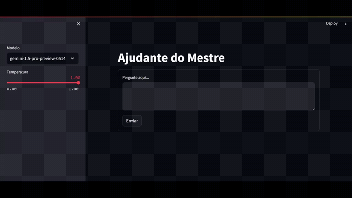

# AjudanTe20  

AjudanTe20 é um assistente que utiliza das capacidades geracionais dos modelos Gemini, juntamente técnicas de RAG ("*Retrieval-augmented generation*"), para fornecer informações relevantes ao mestre de RPG referentes ao sistema Tormenta 20.

Adicionalmente, o assistente pode ajudar na criação de ganchos e personagens para uma aventura, utilizando do contexto do mundo de Arton presente em sua base de conhecimento.

https://ajudante20.com/

## Funcionamento


Veja uma lista de exemplos de uso na página [Exemplos](./exemplos/exemplos.md).

### Parâmetros
Descrição dos parâmetros escolhidos pela barra lateral.

#### Temperatura

Temperatura é um parâmetro que controla o grau de aleatoriedade ou criatividade nas respostas geradas. Funciona ajustando a distribuição de probabilidade das palavras que o modelo pode escolher.

- Temperatura baixa (próxima de 0): O modelo tende a selecionar as palavras mais prováveis, resultando em respostas mais previsíveis, focadas e conservadoras. Isso é útil quando a precisão e a coerência são prioritárias, como em tarefas de tradução ou resumo.

- Temperatura alta (próxima de 1): O modelo tem mais liberdade para escolher palavras menos prováveis, levando a respostas mais diversas, criativas e até mesmo inesperadas. Isso é útil em tarefas que exigem imaginação, como geração de poemas ou roteiros.

Em resumo, a temperatura permite ajustar o equilíbrio entre previsibilidade e criatividade nas respostas do modelo, adaptando-o a diferentes tipos de tarefas e necessidades.

#### Modelo

Veja a documentação oficial da [Google](https://ai.google.dev/gemini-api/docs/models/gemini) para mais informações sobre os diferentes modelos.

## Requerimentos
Para usar a IA Generativa do Vertex AI, você deve ter o pacote Python `langchain-google-vertexai` instalado e uma das seguintes opções:

- Ter as credenciais configuradas para o seu ambiente (gcloud, identidade de carga de trabalho, etc...)
- Armazenar o caminho para um arquivo JSON da conta de serviço como a variável de ambiente `GOOGLE_APPLICATION_CREDENTIALS`.

Veja a [documentação oficial](https://cloud.google.com/docs/authentication/application-default-credentials#GAC) para mais informações.

#### requirements.txt
```
langchain
langchain_chroma
langchain_community
langchain_google_vertexai
streamlit
jq
```

### Agradecimentos

@pyanderson pelos [dados extraídos](https://github.com/pyanderson/roll20_tormenta20_grimoire) do livro.
